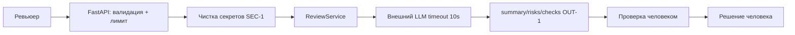

# ADR: решение для первого рабочего сценария

- Статус: proposed
- Дата: 2026-09-23
- Ответственные: azimov21 (автор PR практики)

## Контекст

`ReviewService.review()` пересылает сырой diff во внешний LLM (`review_service.py:20`), вход не валидируется (`api.py:36-37`), нет timeout и формата ответа. Zero-shot ревью (`P1-01`) недоказуемо. Нужен советующий сервис с контрактом `OUT-1` и проверками, решение остается за человеком (`SCOPE-1`).

## Решение

Ввести для первого сценария: строгую схему входа + лимит размера (`API-1`), маскирование секретов (`SEC-1`), timeout 10s с контролируемым ответом (`REL-1`), строгий JSON `summary/risks≤3/checks` (`OUT-1`), риск только с evidence (`QA-1`), минимальное логирование (`OBS-1`).

## Рассмотренные альтернативы

| Альтернатива | Почему не выбрали сейчас |
|---|---|
| Асинхронный LLM-вызов с очередью | Усложняет первый инкремент; синхронный вызов с timeout закрывает учебный кейс |
| Собственная модель вместо внешнего LLM | Вне скоупа практики; внешний вызов уже задан diff |

## Последствия и главный риск

- Положительные последствия: проверяемые ревью (`P1-02`), меньше выдумок, воспроизводимые проверки.
- Ограничения: только советует, не approve/merge; только один PR за вызов.
- Главный риск: пропуск секретов во внешний LLM.
- Как проверим риск: diff с `token=test-123` → в prompt только `[REDACTED]` (`SEC-1`).

## Архитектурная схема

## Как использовали AI

- Для чего: проверить, что 3 риска из `P1-02` закрываются одним решением, и придумать что отбросить
- Тип промпта: master prompt (`P1-02`)
- Строка в [`prompts.md`](prompts.md): `P1-02`
- Что проверили и исправили сами: очередь и свою модель вычеркнул сам — для учебного diff это оверхед; схему рисовал от `Client` к `Result`, `OBS-1` добавил последним когда заметил что про логи забыл
