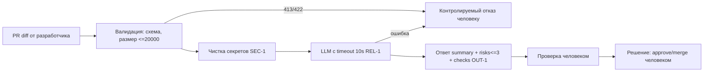

# Анализ процесса: AS IS и TO BE

## AS IS

1. Разработчик открывает PR и вызывает `POST /api/reviews {"diff": ...}`.
2. `api.py:36-37` без валидации передает `payload["diff"]` в `ReviewService.review()`.
3. `review_service.py:20-21` встраивает сырой diff в промпт и синхронно ждет `LLM.generate()` без timeout и обработки ошибок.
4. Ответ `{"comment": answer}` — свободный текст без `summary/risks/checks`; ревьюер вручную отделяет полезное от выдуманного (см. `P1-01`: 5+ пунктов, часть без evidence).
5. Участники: клиент-ревьюер, FastAPI-сервис, внешний LLM. Задержки/потери: ручная проверка выдуманных замечаний, риск утечки секретов (`SEC-1`), 500 вместо `400/413`, зависание при медленном LLM (`REL-1`).

## TO BE

Один небольшой процесс: прием и ревью одного PR по контракту `OUT-1` с проверками.

## Разница

| Что меняется | AS IS | TO BE | Как проверим изменение |
|---|---|---|---|
| Валидация входа | `payload: dict`, `KeyError` → 500 | Схема + лимит 20000 → `400/422/413` (`API-1`) | `POST {}` → `422`, большой diff → `413` |
| Секреты | Сырой diff в промпт | Маскирование `[REDACTED]` (`SEC-1`) | diff с `token=test-123` → в prompt `[REDACTED]` |
| Надежность LLM | Нет timeout, исключение → 500 | Timeout 10s + контролируемый ответ (`REL-1`) | Мок `TimeoutError` → контролируемый ответ, без зависания |
| Формат | Свободный `comment` | `summary/risks/checks` (`OUT-1`, `QA-1`) | Парсинг JSON, доля доказанных рисков (см. `problem.md`) |

## Как использовали AI

- Для чего: восстановить цепочку AS IS по двум hunks diff и набросать TO BE
- Тип промпта: master prompt (`P1-02`)
- Строка в [`prompts.md`](prompts.md): `P1-02`
- Что проверили и исправили сами: вручную сверил шаги с `app/api.py:35-37` и `app/review_service.py:19-22`; выкинул из схемы auth/rate-limit — их нет в diff; mermaid прогнал глазами, ноду отказа `H` завел отдельно чтобы не смешивать 413 и ошибку LLM
