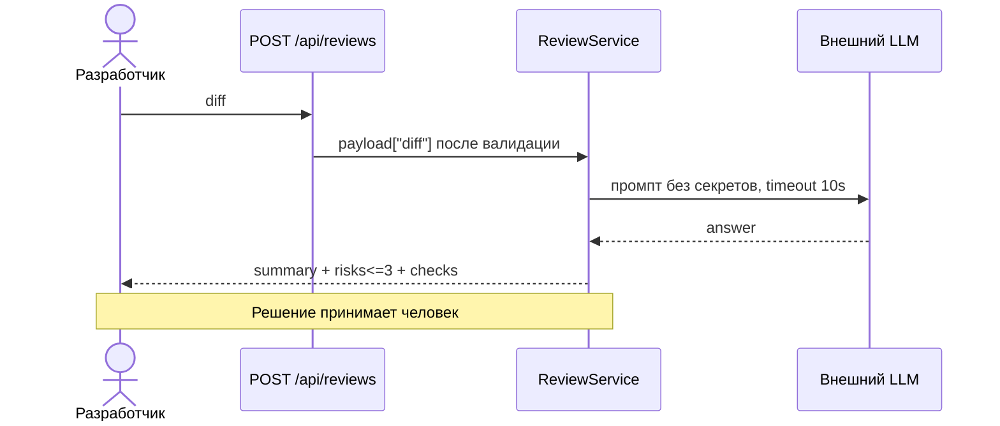

# Use cases и user stories

## Первый рабочий сценарий

**Когда** разработчик отправляет diff через `POST /api/reviews`, **система** валидирует вход, чистит секреты, вызывает LLM с timeout и возвращает `summary + risks (≤3 с evidence) + checks`, **а пользователь получает** проверяемое ревью, по которому за минуты принимает решение.

Не входит в этот сценарий:

- approve/merge кодом, действия в GitHub (`SCOPE-1`)
- auth/rate-limit, UI, обучение модели, snake_case/i18n

## Use case

| Поле | Значение |
|---|---|
| Актор | Разработчик/ревьюер |
| Триггер | `POST /api/reviews {"diff": ...}` |
| Предусловия | diff ≤ 20000 символов, валидный JSON со строковым `diff` |
| Основной результат | `summary` + до 3 `risks{file,line,evidence,risk}` + `checks` по `OUT-1/QA-1` |
| Ошибка или отказ | `400/422` (валидация), `413` (размер, `API-1`), контролируемый ответ при ошибке/timeout LLM (`REL-1`) |



## User stories и acceptance criteria

```gherkin
Feature: AI-ревью одного PR
  Scenario: Позитивный — доказанное ревью
    Given diff учебного PR из TRAINING_PR.diff
    When вызываю POST /api/reviews с валидным diff
    Then получаю summary + risks до 3 с file/line/evidence + checks
    And каждый риск подтвержден строкой diff или SEC-1/API-1/REL-1

  Scenario: Негативный или граничный — большой diff и секреты
    Given diff > 20000 символов с token=test-123 внутри
    When вызываю POST /api/reviews
    Then получаю 413 по API-1
    And при допустимом размере секреты в prompt заменены на [REDACTED] по SEC-1
```

## Как использовали AI

- Для чего: вытащить из `P1-02` use case и два gherkin-сценария под `OUT-1`
- Тип промпта: master prompt (`P1-02`)
- Строка в [`prompts.md`](prompts.md): `P1-02`
- Что проверили и исправили сами: sequence-шаблон переписал под реальные участники (`API/Svc/LLM`), убрал абстрактные `System/AI`; негативный сценарий собрал из двух проверок (`413` + `[REDACTED]`), gherkin прогнал глазами по шагам Given/When/Then
