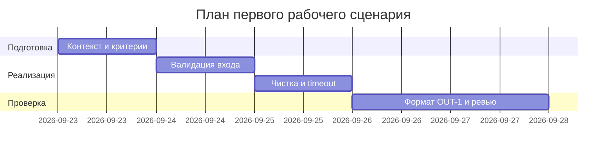

# План поставки

## Инкременты и ответственность

| Инкремент | Наблюдаемый результат | Что делает человек | Что делает AI или субагент | Проверка | Зависимости |
|---|---|---|---|---|---|
| 1 | Контракт и валидация входа | Принимает схему `diff: str`, лимит 20000, коды `400/422/413` | Генерирует черновик схемы и тестов по `API-1` | `POST {}` → `422`, большой diff → `413` | `problem.md`, `analysis.md` |
| 2 | Безопасность и надежность LLM | Принимает маскирование и timeout-политику | Генерирует черновик чистки `[REDACTED]` и обработки `TimeoutError` | diff с `token` → `[REDACTED]`; мок timeout → контролируемый ответ | Инкремент 1, `SEC-1/REL-1/OBS-1` |
| 3 | Формат и приемка | Проверяет `summary/risks/checks`, принимает DoD | Генерирует ответ по `OUT-1/QA-1`, сверяет `P1-02` | Парсинг JSON, сравнение `P1-01 vs P1-02`, `make step1` | Инкременты 1-2, `prompts.md` |

## Диаграмма Ганта

## Как использовали AI

- Для чего: разложить работу на 3 инкремента чтобы каждый закрывал один риск из `P1-02`
- Тип промпта: master prompt (`P1-02`)
- Строка в [`prompts.md`](prompts.md): `P1-02`
- Что проверили и исправили сами: даты переписал под свою неделю (старт 23.09, шаблонные 01.09 удалил); инкремент 2 разделил на чистку и timeout потому что это разные правила `SEC-1`/`REL-1`; approve/merge оставил за собой по `SCOPE-1`
